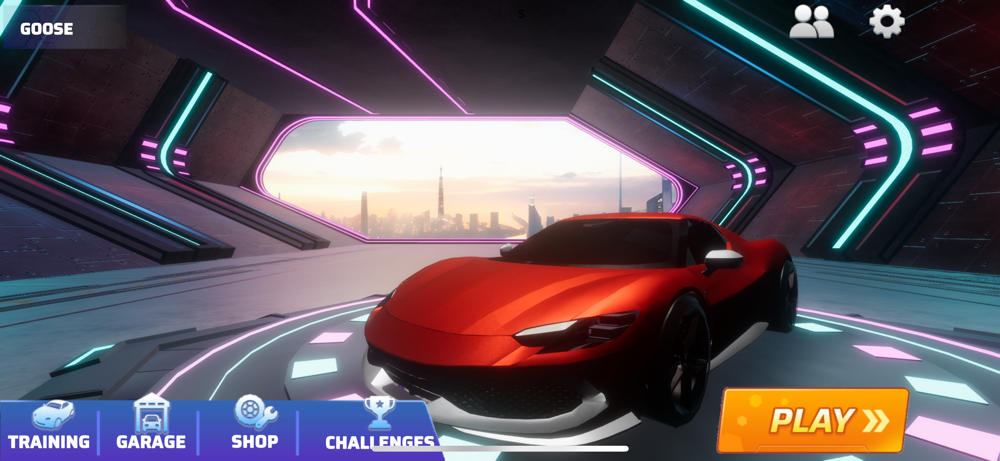
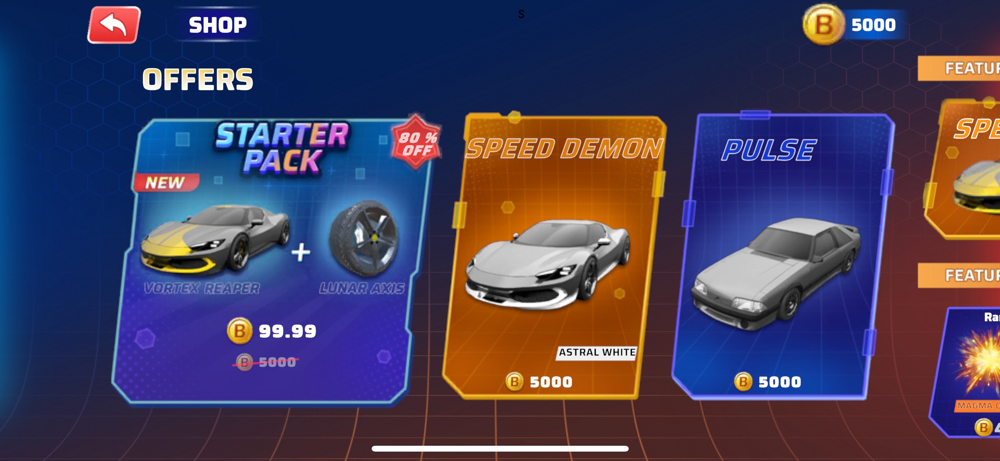
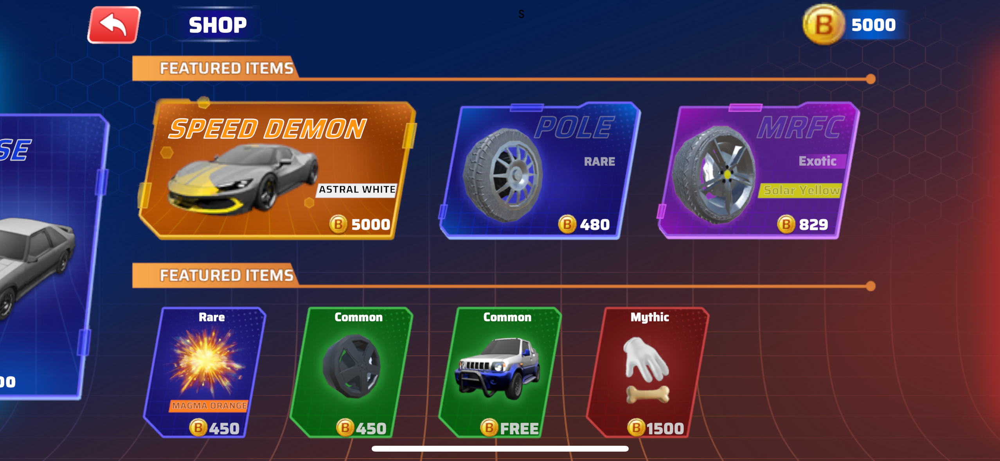

# Double Tap 🚗⚽️

Welcome to **Double Tap**—a fast-paced, physics-based soccer experience crafted specifically for mobile devices!

## 🎮 Overview

Inspired by the thrilling mechanics of **Rocket League**, this game brings the excitement and skillful gameplay of car-based soccer directly to your mobile phone. Built using **Unity and C#**, it delivers smooth, responsive controls and dynamic physics tailored for engaging multiplayer matches.

## 🌟 Key Features

- Realistic vehicle physics and intuitive controls
- Multiplayer matchmaking with ranked gameplay
- AI-enhanced mechanics for accessible yet deep gameplay
- Visually appealing environments optimized for mobile performance

## 📸 Screenshots

## 📺 Demo Video

Watch the game in action:

[▶️ Watch on YouTube](https://www.youtube.com/watch?v=U7OjdbXFLAo&ab_channel=LucasSj%C3%B6berg)

## 🚀 Future Plans

- Expanding gameplay modes
- Adding customizable vehicles and skins
- Further optimizations and enhancements

---

Thanks for checking out my game! Stay tuned for more updates and improvements.
